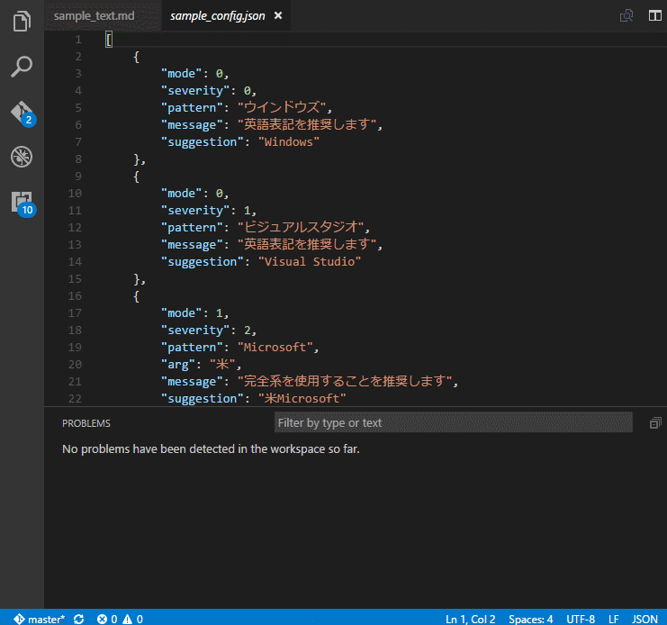

# SimpleTypoChecker



## これは何
主にVSCode向けの表記ゆれ検出を行う拡張機能です。  
診断機能とクイック修正機能も実装しました。  

表記ゆれがひどいので自分で使うことを用途にざっと作ってみました。  

## 拡張機能のインストール方法
1. GitHubのリリースページからvsixをダウンロード
1. `code stc.vsix`

## 使い方
1. 拡張機能をインストール
1. 設定ファイルを設置
1. VSCodeのユーザー設定の末尾に設定ファイルへのパスを追加  
 ```    "simpletypochecker.grammer": "/path/to/setting.json"```
1. コマンドパレット（`Ctrl/Command`+`Shift`+`P`）から`STC: Enable document checker`を実行
    * この状態で**保存時**と**ドキュメント切替時**に自動で検証が行われる
    * 手動で検証を起動したい場合、コマンドパレットから`STC: Check the current document`を実行
    * 起動中は左下にステータスが表示される
1. 終了するにはVSCodeを終了するか、`STC: Disable document checker`を実行

## 設定ファイルの書き方
* 例
```json
[
    {
        "mode": 0,
        "severity": 3,
        "pattern": "ウインドウ",
        "arg": "",
        "message": "ウインドウは表記ゆれです。",
        "suggestion": "ウィンドウ"
    },
    {
        "mode": 1,
        "severity": 2,
        "pattern": "Microsoft",
        "arg": "米",
        "message": "Microsoftは米Microsoftと表記してください。",
        "suggestion": "米Microsoft"
    },
    {
        "mode": 2,
        "severity": 1,
        "pattern": "エディタ",
        "arg": "ー",
        "message": "エディタは長音をつけてください。",
        "suggestion": "エディター"
    }
]
```
### mode
* **0** : 部分文字列の完全一致検索。patternの文字列を見つけ次第出力します。
* **1** : 前方の表記ゆれ検索(?)。（例えば「Microsoft」を検索して「米Microsoft」にしたい場合など）
* **2** : 後方の表記ゆれ検索(?)。（例えば「エディタ」を検索して「エディター」にしたい場合など）

### severity
* **0** : Hint
* **1** : Information
* **2** : Warning
* **3** : Error

### pattern
* 文字列もしくは正規表現

### arg
* `mode`が`1`か`2`のときのみ使用。文字列もしくは正規表現

### message
* エディタに表示するメッセージ

### suggestion
* 修正可能な場合は修正後の文字列。空白の場合はクイックアクション（電球マーク）を表示しません。

### そのほか
* 詳細なスキーマは`typings/simpletypochecker/grammer.d.ts`を参照

## TODO
* プロジェクトごとに異なるgrammerを読み込めるように挙動を調整

